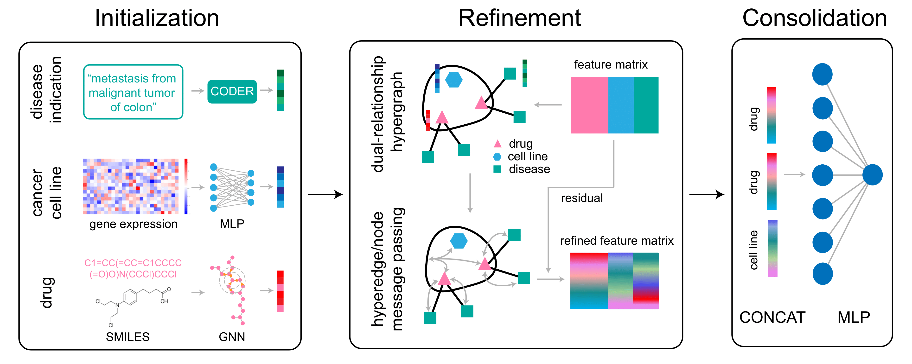

# HERMES



We introduce a salient deep hypergraph learning method, namely, **H**eterogeneous **E**ntity **R**epresentation for **ME**dicinal **S**ynergy prediction (**HERMES**), to predict anti-cancer drug synergy.

HERMES integrates heterogeneous data sources, encompassing drug, cell line, and disease information, to provide a comprehensive understanding of the interactions involved. By leveraging advanced hypergraph neural networks with gated residual mechanisms, HERMES can effectively learn complex relationships/interactions within the data.

## Requirements

- `python 3.8`
- `deepchem==2.7.1`
- `einops==0.8.0`
- `numpy==1.24.4`
- `pandas==2.0.3`
- `rdkit==2023.3.3`
- `scikit_learn==1.3.0`
- `scipy==1.8.1`
- `torch==1.10.1+cu111`
- `torch_geometric==2.0.0`

## Installation

1. Create and activate a new conda environment:

    ```bash
    conda create -n hermes
    conda activate hermes
    ```

2. Install the required packages:

    ```bash
    pip install -r requirements.txt
    ```

## Running the Model

1. Navigate to the `Model` directory:

    ```bash
    cd Model
    ```

2. Execute the HERMES script:

    ```bash
    python3 HERMES/main.py
    ```
